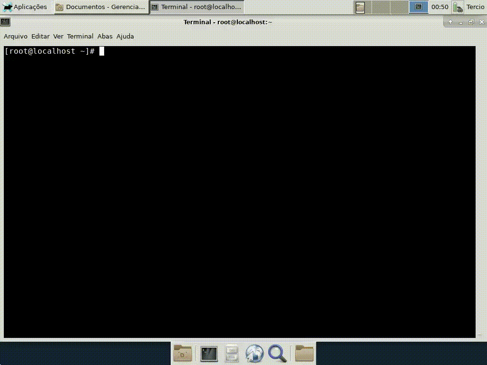

# Kerberos

Trabalho de Tópicos Especiais em Segurança da Informação - ECOE010 - da Universidade Federal de Itajubá (UNIFEI).  
Curso: Engenharia de Computação.  
Período: 2º Semestre de 2018   
Equipe: 

        Tercio Naoki Sato 30697
       
        Gabriel Pedro Krupa 27845
       
        Felipe Silva de Paula 35272 
         
         
# Programas        
* Oracle Virtual Box 5.2
* CentOS 7
* Cliente, Servidor e KDC Kerberos

# Instalação

## 1) Instalação e configuração do Kerberos

Precisa-se do cliente e dos utilitários do Kerberos em todas as máquinas.
Para instalá-lo usamos o comando abaixo:
```
 yum install krb5-workstation krb5-libs krb5-auth-dialog 
```

## 2) Instalar o Kerberos server em apenas uma máquina

Agora cria-se um servidor Kerberos.
Como estamos utilizando uma máquina, instalamos o servidor Kerberos na mesma máquina.
Abaixo está o comando para instalar o servidor Kerberos:
```
yum install krb5-server
```
É necessário que o cliente já esteja instalado na máquina.


## 3) Configurar o Kerberos

Existem dois arquivos de configuração:
```
i) /var/kerberos/krb5kdc/kdc.conf
ii) /etc/krb5.conf
```
Usamos esses dois arquivos para definir um Kerberos Realm e configurá-lo.
O Realm (domínio) é um limite lógico dentro do qual o Kerberos tem autoridade para autenticar alguém. É como um nome. A partir dele, cria-se um domínio. Obervação: O nome de um domínio é sensível a maiúsculas e minúsculas.

Posteriormente, usamos o kdc.conf para definir um domínio. Vamos fazer isso pelo comando:
```
vi /var/kerberos/krb5kdc/kdc.conf
```
A primeira seção [kdcdefaults] é para alguns números de porta, por os valores são mantidos por padrão.
A segunda seção [realms] é onde definem-se os domínimos. É dado um exemplo de entrada ao executar esse comando, mas mudamos para algum nome significativo. Pode-se qualquer nome desejado, desde que tenha alguma relação com a máquina.
```
“LOCALHOST”.
```
Um domínio deve ter configurações, incluindo a localização do KDC na rede e os algoritmos de criptografia suportados. As outras configurações que são geradas automaticamente são para definir alguns valores padrões e não alterarmos elas.

A segunda parte da configuração do Realm reside no próximo arquivo de configuração.

Idealmente, mesclamos os dois arquivos de configuração, mas, a partir de agora, eles são dois arquivos diferentes.
Pelos comandos abaixo, abrimos o outro arquivo de configuração e definimos mais algumas configurações de domínio.
```
vi /var/kerberos/krb5kdc/kdc.conf
vi /etc/krb5.conf
```
Muda-se o nome do domínio padrão e fazemos o nosso domínio como padrão pelo nome “UNIFEI.LOCAL”.
A próxima configuração é muito crítica. Especificamos o local do servidor Kerberos que o domínio estará usando, alterando a linha 
```
“kdc = kerberos.example.com”.
```
Então, criamos uma entrada para o domínio e substituímos esses valores pelo nome do host do servidor KDC:
```
[realms]

LOCALHOST = {
     kdc = localhost  
     admin_server = localhost  
}
```
Para o segundo, traduzimos um nome de host para um nome de domínio. Essa entrada diz quais máquinas fazem parte desse domínio.
Portanto, qualquer nome de host sob .unifei) faz parte desse domínio.
```
[domin_realm]
   . localhost = LOCALHOST
   localhost = LOCALHOST
   ```
Isso significa que x.localhost, y.localhost ou qualquer outro subdomínio com .localhost são membros do mesmo domínio. 
A segunda entrada diz que o domínio localhost é o membro do mesmo Realm.

## 4) Criar o KDC database para o Realm criado
Usamos o seguinte comando:
```
kdb5_util create –r LOCALHOST –s
```
Esse comando solicitará uma senha mestre para o database.
O Kerberos criptografa o database usando essa senha mestre. Para restaurar o KDC database de um backup ou reiniciar o database, precisa-se dessa senha. Não há problema em digitar a senha no momento do database na restauração. Mas fornecer essa senha em cada reinicialização é um problema. Para evitá-lo, criamos o banco de dados e usamos a opção –s no comando citado acima. A opção -s criará um arquivo stash para armazenar a senha. O KDC usará automaticamente a senha do arquivo stash em cada reinicialização. O database do Kerberos mantém identidades. Em seguida, ele atribui tickets para essas identidades. Na terminologia do Kerberos, isso é chamamos de Principal.

A Principal no Kerberos é composto de três componentes. Por exemplo:
1. Primary
2. Instance
3. Realm
```
root/admin@LOCALHOST
root@LOCALHOST
```
O root é a principal. Admin é a instância, e supõe-se que  já se conhece o domínio, isto é, LOCALHOST seria o Realm.
A parte Instance é opcional. 
Tanto root quanto root/admin são dois Principals diferentes para o Kerberos.

## 5) Fazer o update do arquivo ACL e Criar o KDC admin

Na linha: 
```
“/admin@LOCALHOST”
```
Nós apenas mudamos o nome do Realm. Esta linha diz que qualquer usuário com uma instância Admin deve ter todos os tipos de acesso.
Em seguida, criamos um administrador para o KDC. Nós usamos o utilitário "kadmin.local". Essa ferramenta funciona somente no servidor KDC e não pode executá-lo em máquinas clientes.

Feito isso,  tem-se um prompt do kadmin. E adicionamos um principal com uma instância do administrador pelo comando abaixo:
```
addprinc root/admin@LOCALHOST
```
Definimos uma senha e o Kerberos está pronto para ser iniciado e testado.

## 6) Iniciar o Kerberos service

Para iniciar o KDC e o servidor admin do Kerberos, utilizamos os comandos para ter certeza de que eles reiniciarão automaticamente, mostrado abaixo:
```
service krb5kdc start
servisse kadmin start
chkconfig krb5kdc on
chkconfig kadmin on
```
Agora está tudo pronto para usar o Kerberos. Pode-se utilizar o comando klist para verificar se você tem um ticket no cache.
Caso não houver nenhum ticket, pode-se usar o comando kinit root/admin para conseguí-lo.
Caso executado o comando kinit root/admin, será gerado um ticket. E a partir de agora, tem-se um Principal no database do KDC.
Caso queira criar mais alguns Principais, pode-se usar o comando kadmin.

Anteriormente foi usado o utilitário local kadmin. Mas desde que começou-se o servidor admin Kerberos, agora podemos usar a ferramenta kadmin padrão.

Se entrar com a senha. Estará no prompt do kadmin. O comando para criar um principal é o mesmo que foi usado anteriormente, addprinc.
E caso queira remover os tickets criados, usa-se o comando kdestroy.


# Simulação



# Nota

## Feedback
Faltou detalhar caso de uso.

Critérios 
1. README [3]
  * Detalhamento - 0.6
  * Informações do caso de uso escolhido - 0.5
  * Informações da configuração - 1
2. Commits [3] - 2.8 - Muito bom, com participaçao dos outros membros. 
3. .gitignore [1] - 0
4. Código [3] - 2.3
5. Pontos extras
  * Extras (POC, GIF, Video, esforço) - 1
  * Organização - 0.3

Total = 8.5
(Não é necessariamente a nota final)


